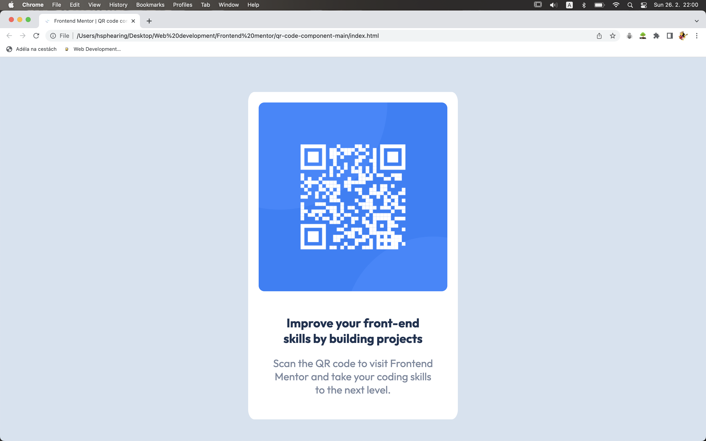

# Frontend Mentor - QR code component solution

This is a solution to the [QR code component challenge on Frontend Mentor](https://www.frontendmentor.io/challenges/qr-code-component-iux_sIO_H). Frontend Mentor challenges help you improve your coding skills by building realistic projects. 

## Table of contents

- [Overview](#overview)
  - [Screenshot](#screenshot)
  - [Links](#links)
- [My process](#my-process)
  - [Built with](#built-with)
  - [What I learned](#what-i-learned)
  - [Useful resources](#useful-resources)
- [Author](#author)

## Overview

Simple QR code component using HTML and CSS.

### Screenshot



### Links

- Solution URL: (https://github.com/BarboraBrhlova/QR-Code-Frontend-Mentor)
- Live Site URL: [Add live site URL here](https://your-live-site-url.com)

## My process

### Built with

- Semantic HTML5 markup
- CSS custom properties

### What I learned

```css
.caption {
    display: block;
}
```

### Useful resources

- (https://www.w3schools.com/) 
- (https://www.udemy.com/) 

## Author

- Barbora Brhlová
- Frontend Mentor - [@BarboraBrhlova](https://www.frontendmentor.io/profile/BarboraBrhlova)
